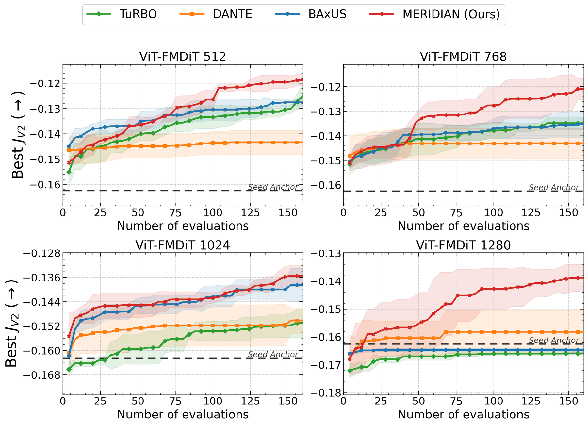
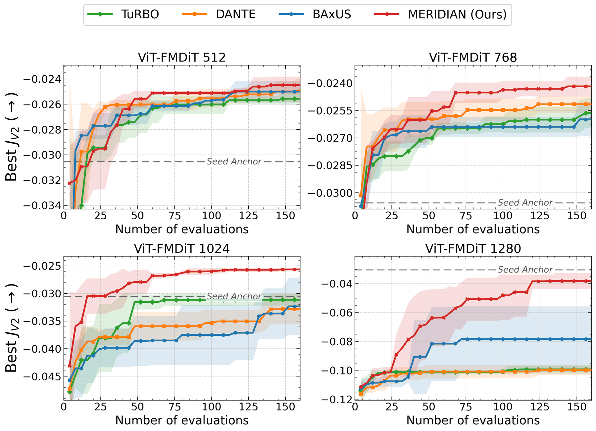

# MERIDIAN

**Manifold-Embedded Robust Inverse Design via Iterative Acquisition Networks: an active-learning latent optimiser for target-driven inverse design under a tight simulation budget. The repository also contains the complete closed loop in which MERIDIAN designs grain morphology and HCP texture of extruded magnesium alloys against a DAMASK crystal-plasticity oracle.**

MERIDIAN searches the latent space of a generative model for designs that meet a target property tuple, here `(σ_y, n, K, σ_u)`. Each evaluation is an expensive physics simulation. A design run fits into 160 simulations (40 rounds × batch 4), warm-started from 100 pre-simulated seeds.

This repository holds the optimiser **O** and the closed-loop pipeline (Co-PiLOT) of our physics-augmented inverse-design framework for extruded Mg. They are described in the Co-PiLOT NeurIPS 2026 paper (Method, E2, appendices) and the Acta Materialia paper (Secs. 6–8).

<p align="center"></p>
<p align="center"><em>The closed loop. A latent z is decoded by the flow-matching decoder D into an RGB orientation image. The orientation codec Ψ converts it into a DREAM.3D RVE, and DAMASK deforms that RVE in uniaxial tension. The objective J scores the extracted properties, and MERIDIAN (O) proposes the next latent batch.</em></p>

| Repository | Role in the pipeline |
|---|---|
| [orientation-codec](https://github.com/mahishguru/orientation-codec) | DREAM.3D orientation field ↔ RGB image, Ψ |
| [microstructure-encoder-decoder](https://github.com/mahishguru/microstructure-encoder-decoder) | ViT encoder + FM-DiT decoder, the latent space D ([weights on 🤗](https://huggingface.co/mahishguru/microstructure-encoder-decoder)) |
| **meridian** (this repo) | MERIDIAN, the baselines, the closed-loop pipeline and the automated DAMASK simulations, O |

📦 **Training dataset of the decoder** (101,000 synthetic RVEs as codec-encoded orientation maps, from which the seed RVEs are drawn): [Zenodo record 23036836](https://zenodo.org/records/23036836) (DOI [10.5281/zenodo.23036836](https://doi.org/10.5281/zenodo.23036836), CC BY 4.0; files available on request through Zenodo)

## What is in this repository

| Component | Where |
|---|---|
| **MERIDIAN** optimiser | `meridian/optimizers/meridian/` |
| Baselines: **TuRBO**, **BAxUS**, **DANTE** | `meridian/optimizers/{turbo.py, baxus.py, dante/}` |
| Closed loop: decode → codec → DAMASK → properties → objective → optimiser | `meridian/loop.py`, `meridian/decoders/`, `meridian/simulation/`, `meridian/objectives/` |
| Automated DAMASK simulations, the calibrated HCP phenopowerlaw models for AZ31 and Mg-5Gd, and example runs ([details](simulations/README.md)) | `simulations/` |
| Experiment configurations of both papers | `configs/acta2026/`, `configs/neurips2026/` |
| Seed caches: 100 pre-simulated seeds per alloy, decoder and objective | `data/seed_caches/` |
| Campaign launchers and seed-cache tools | `scripts/` |

Documentation:
- [MERIDIAN algorithm](docs/algorithm.md): how each round works, and how to use it on your own black-box function.
- [Results](docs/results.md): optimiser comparison tables, achievability map, objective landscape.
- [Usage](docs/usage.md): objectives, seed caches, configuration reference.
- [Automated DAMASK simulations](simulations/README.md): oracle inputs, drivers, example runs.

## Results

Optimiser comparison under a fixed budget of 160 DAMASK evaluations, with four repetitions and four FM-DiT latent widths. MERIDIAN reaches the best objective for both alloys at every width. The full tables are in [docs/results.md](docs/results.md).

<table>
<tr>
<td align="center"><br><em>AZ31</em></td>
<td align="center"><br><em>Mg-5Gd</em></td>
</tr>
</table>

## Installation

```bash
git clone https://github.com/mahishguru/meridian.git && cd meridian
pip install -e .                 # MERIDIAN + baselines only (numpy, torch, BoTorch, GPyTorch)
pip install -e ".[pipeline]"     # + closed loop: microstructure-encoder-decoder, orientation-codec, DAMASK Python API
```

Requires Python ≥ 3.9. The paper runs used Python 3.9, PyTorch 2.8, BoTorch 0.10.0 and GPyTorch 1.11.

The closed loop additionally needs:

1. **DAMASK 3** with the `DAMASK_grid` spectral solver on `PATH`, for example `conda create -n damask -c conda-forge damask`. See the [DAMASK installation guide](https://damask-multiphysics.org/installation/). The papers used DAMASK 3.0.2. The launchers add a conda env to `PATH` when you set `DAMASK_ENV=/path/to/envs/damask`.
2. **Decoder weights, texture priors and SAM**, downloaded into `weights/` from Hugging Face (public):
   ```bash
   scripts/download_weights.sh              # FM-DiT-512/768/1024/1280 + ViT-DiT, texture priors, SAM ViT-B
   ```
3. **Hugging Face access to Stable Diffusion 3.5 medium** (gated), the frozen backbone of the FM-DiT decoder. Accept its licence and `export HF_TOKEN=...`.
4. A CUDA GPU for the decoder, which holds the 2.5 B-parameter SD3.5 backbone in bfloat16, plus CPU cores for DAMASK. By default each run evaluates 4 RVEs in parallel with 4 threads each; `simulation.n_threads` and `simulation.parallel_batch` control this.

## Quick start

```bash
# 1. MERIDIAN on a synthetic black box (CPU, ~1 min)
python examples/standalone_blackbox.py

# 2. full loop with a mock decoder and a mock oracle, all four optimisers (CPU, ~15 s)
pytest

# 3. one real design round: FM-DiT-512 decode -> SAM -> ODF calibration -> codec -> 4 DAMASK runs -> J
python scripts/run_ablation.py --config configs/acta2026/az31_fmdit_meridian_v2.yaml \
    --seed-cache data/seed_caches/seed_cache_AZ31_v2_fmdit.npz --group quickstart \
    --only meridian --decoders fmdit --objectives v2 --override loop.n_iterations=1
```

Every run writes `results/<group>/<decoder>__<optimizer>__<objective>__r<k>/` with `log.jsonl` (one line per evaluation: z, properties, objective, success), `result.json`, `summary.json`, decoded images and the DAMASK input RVEs.

## Reproducing the design campaigns

| Experiment | Command | Configs |
|---|---|---|
| AZ31 optimiser comparison, 4 widths × 4 optimisers | `scripts/run_campaign.sh AZ31 fmdit` (also `fmdit_768`, `fmdit_1024`, `fmdit_1280`) | `configs/acta2026/az31_<decoder>_<optimizer>_v2.yaml` |
| Mg-5Gd optimiser comparison | `scripts/run_campaign.sh Mg5Gd fmdit` (and the other widths) | `configs/acta2026/mg5gd_<decoder>_meridian_v2.yaml` |
| AZ31 target-achievability grid (16 targets) | `scripts/run_achievability_grid.sh` | `configs/acta2026/fig15/` |
| Objective landscape (latent vs. direct RVE perturbations) | `scripts/run_landscape_study.sh` | `configs/acta2026/*_fmdit_768_meridian_v2.yaml` |
| NeurIPS experiments (ViT-DiT, FM-DiT 512/768/1024; objectives V1, V2) | `scripts/run_ablation.py --config configs/neurips2026/...` | `configs/neurips2026/` |

Repetitions are selected with `rep_start`/`repeats` (e.g. `scripts/run_campaign.sh AZ31 fmdit meridian 0 4`). Runs resume from their last completed round when relaunched. `MAX_PAR` runs several optimisers at once, one per GPU.

## Repository layout

```
meridian/
├── loop.py                 # suggest -> decode -> simulate -> score -> update
├── config.py, cli.py       # YAML loader with overrides; meridian-run / meridian-ablation
├── decoders/               # FM-DiT and ViT-DiT adapters (microstructure_ed), mock decoder
├── simulation/             # codec bridge (SAM, ODF calibration), DAMASK runner, post-processing, property extraction
├── objectives/             # V1 toughness, V2/V3 target distance
└── optimizers/
    ├── meridian/           # MERIDIAN: DKL surrogate, subspace, trust region, acquisition, DPP, MCTS restart
    ├── turbo.py, baxus.py  # TuRBO-1, BAxUS
    └── dante/              # DANTE (neural surrogate + tree exploration)
configs/                    # base.yaml (reference/smoke), acta2026/, neurips2026/
data/seed_caches/           # 100-seed warm-start caches
simulations/                # DAMASK inputs, drivers, example runs
scripts/                    # campaign launchers, seed-cache tools, landscape study, grid design
examples/                   # standalone MERIDIAN usage
tests/                      # mock-pipeline tests for all optimisers; DAMASK end-to-end scripts
```

## License

MIT, see [LICENSE](LICENSE). The TuRBO and BAxUS implementations are adapted from the BoTorch tutorials (MIT); see [NOTICE](NOTICE).

## Acknowledgements

Developed at the Institute of Material and Process Design, Helmholtz-Zentrum Hereon, Geesthacht, Germany. Crystal-plasticity simulations use [DAMASK](https://damask-multiphysics.org), the optimisers build on [BoTorch](https://botorch.org) and [GPyTorch](https://gpytorch.ai), and grain segmentation uses [Segment Anything](https://github.com/facebookresearch/segment-anything).
