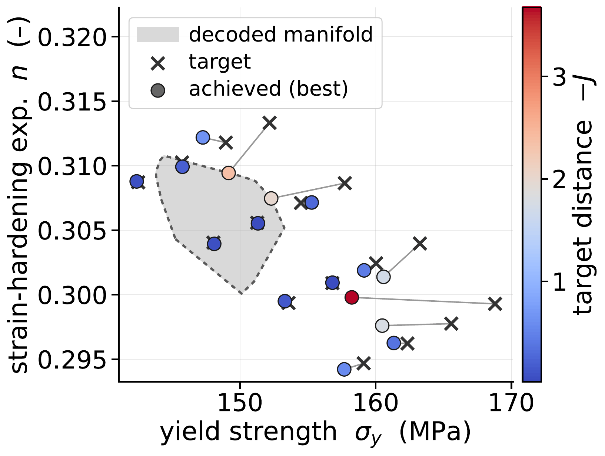
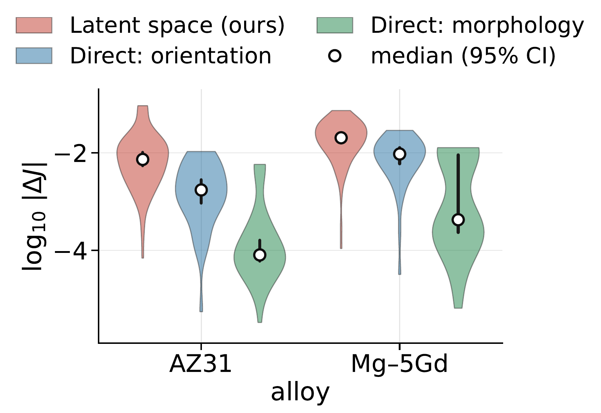

# Results

## Optimiser comparison under a fixed budget (Acta Materialia)

160 DAMASK evaluations per run, identical seed cache and feasibility gates for all optimisers, four repetitions, FM-DiT decoders of four latent widths.

<table>
<tr>
<td align="center"> <em>AZ31</em></td>
<td align="center"> <em>Mg-5Gd</em></td>
</tr>
</table>

Best objective after 160 evaluations (mean ± std over four repetitions; larger is better; 0 is the target):

| AZ31 | FM-DiT-512 | FM-DiT-768 | FM-DiT-1024 | FM-DiT-1280 |
|---|---|---|---|---|
| TuRBO | −0.1250 ± 0.0048 | −0.1349 ± 0.0026 | −0.1510 ± 0.0047 | −0.1659 ± 0.0005 |
| DANTE | −0.1433 ± 0.0047 | −0.1430 ± 0.0062 | −0.1502 ± 0.0042 | −0.1581 ± 0.0078 |
| BAxUS | −0.1276 ± 0.0015 | −0.1353 ± 0.0056 | −0.1385 ± 0.0055 | −0.1646 ± 0.0006 |
| **MERIDIAN** | **−0.1187 ± 0.0022** | **−0.1209 ± 0.0045** | **−0.1355 ± 0.0037** | **−0.1387 ± 0.0049** |

| Mg-5Gd | FM-DiT-512 | FM-DiT-768 | FM-DiT-1024 | FM-DiT-1280 |
|---|---|---|---|---|
| TuRBO | −0.0256 ± 0.0005 | −0.0256 ± 0.0008 | −0.0311 ± 0.0010 | −0.0994 ± 0.0028 |
| DANTE | −0.0249 ± 0.0010 | −0.0252 ± 0.0005 | −0.0328 ± 0.0028 | −0.0999 ± 0.0035 |
| BAxUS | −0.0250 ± 0.0009 | −0.0260 ± 0.0009 | −0.0323 ± 0.0051 | −0.0784 ± 0.0227 |
| **MERIDIAN** | **−0.0245 ± 0.0007** | **−0.0242 ± 0.0005** | **−0.0257 ± 0.0003** | **−0.0382 ± 0.0055** |

The best seeds score −0.1626 (AZ31) and −0.0306 (Mg-5Gd). Objective values are normalised per alloy and cannot be compared between the two tables.

## Target achievability and landscape (Acta Materialia)

<table>
<tr>
<td align="center" width="50%"> <em>AZ31 achievability map. MERIDIAN on FM-DiT-512 against a 4 × 4 grid of (σ_y, n) targets, 2,560 DAMASK evaluations in total.</em></td>
<td align="center"> <em>Sensitivity of the objective to latent steps, grain reorientation and boundary migration (320 paired DAMASK simulations).</em></td>
</tr>
</table>
