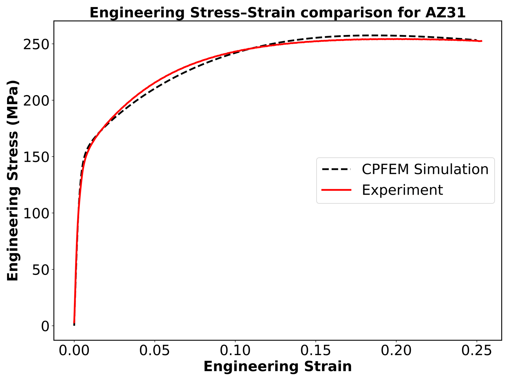
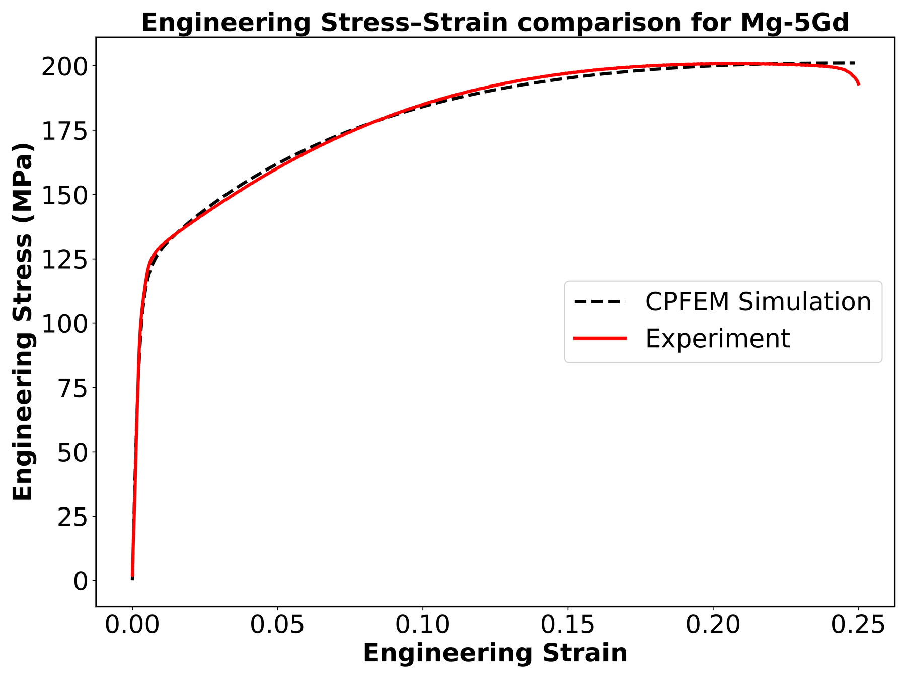

# Automated DAMASK simulations

The commands below are run from the repository root.

`simulations/` contains the crystal-plasticity oracle's inputs and the drivers that produced the seed simulations:

| File | Content |
|---|---|
| `AZ31_Phenopower.yaml`, `Mg-5Gd_Phenopower.yaml` | HCP phenopowerlaw parameter sets used as the oracle for the two alloys: basal, prismatic, 1st-order pyramidal ⟨a⟩ and 2nd-order pyramidal ⟨c+a⟩ slip, plus tension and compression twinning |
| `load.yaml` | uniaxial tension along the extrusion direction, strain rate 10⁻³ s⁻¹, 250 s in 1,250 increments |
| `run_seed_simulations_flatpool.py` | simulate a random subset of an RVE pool: encoded PNG → DREAM.3D → DAMASK → properties |
| `run_random_simulations.py`, `replace_out_of_band.py`, `check_status.py` | per-RVE simulation worker, grain-band resampling, progress report |
| `examples/sim_orientation_103/`, `examples/sim_orientation_1449/` | two complete AZ31 runs: input RVE (`.dream3d` + `.xdmf`), DAMASK material and load files, stress–strain curve, extracted properties, microstructure image |
| `examples/seed_simulations_AZ31.csv` | properties (σ_y, n, K, σ_u, ε_u, E, …) of all 100 AZ31 seed simulations |

Simulate one of the example RVEs:

```python
from meridian.simulation.damask import DAMASKRunner
from meridian.simulation.postproc import StressStrainProcessor
from meridian.simulation.extractor import PropertyExtractor

runner = DAMASKRunner("simulations/load.yaml", "simulations/AZ31_Phenopower.yaml",
                      target_phase="AZ31", n_threads=8)
res = runner.run("simulations/examples/sim_orientation_103/AZ31_extruded_orientation_103.dream3d",
                 "my_sim/")                                    # DREAM.3D -> material.yaml + .vti -> DAMASK_grid
csv = StressStrainProcessor(loading_direction="x").process_to_csv(res.hdf5_path, "my_sim/stress_strain.csv")
print(PropertyExtractor().extract(csv).to_dict())            # sigma_y, n, K, sigma_u, epsilon_uniform, ...
```

To run the whole chain for a pool of encoded RVE images:

```bash
python simulations/run_seed_simulations_flatpool.py --pool-dir /path/to/rve/AZ31_extruded --n 100 --workers 8
```

<table>
<tr>
<td align="center"><br><em>AZ31</em></td>
<td align="center"><br><em>Mg-5Gd</em></td>
</tr>
</table>
<p align="center"><em>Simulated vs. measured engineering stress–strain curves in ED tension for the two calibrated parameter sets.</em></p>
